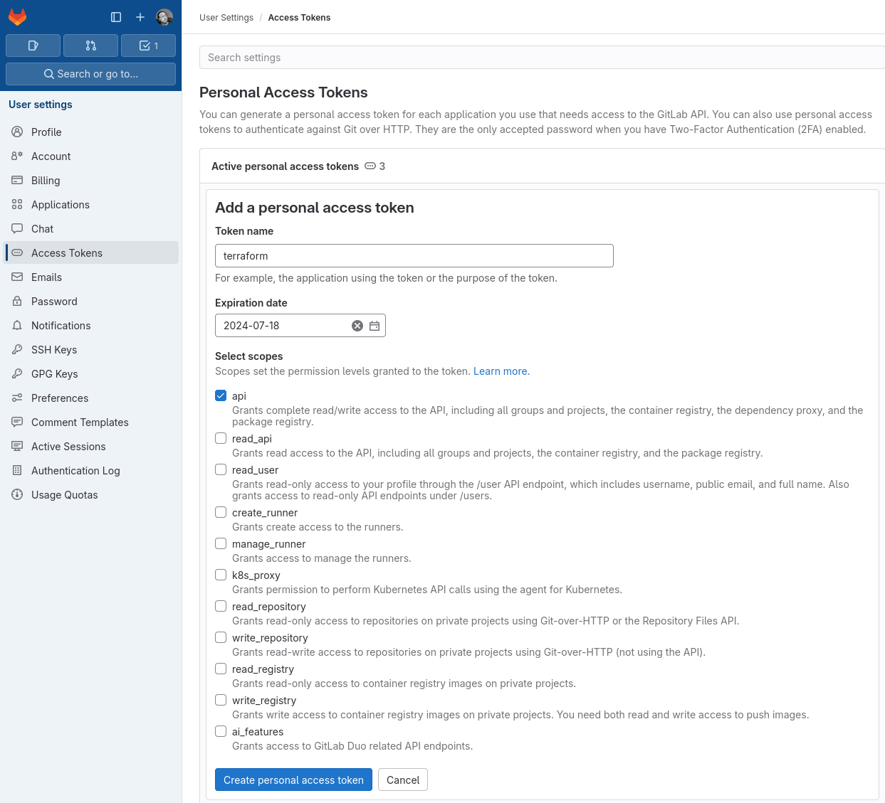
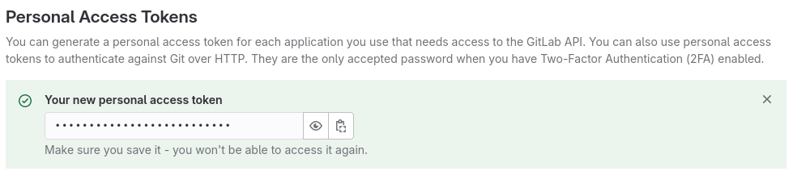

# Scaleway k8s cluster

Useful links:

| Descrption                           | Link                                                                |
|--------------------------------------|---------------------------------------------------------------------|
| Provider documentation               | https://registry.terraform.io/providers/gitlabhq/gitlab/latest      |
| GitLab personal access tokens        | https://gitlab.com/-/user_settings/personal_access_tokens           |
| How to create personal access tokens | https://docs.gitlab.com/ee/user/profile/personal_access_tokens.html |

## Pre-requisites

* A GitLab Account
* A GitLab personal access token (see _Getting credentials_ step)

## Getting credentials

To create a personal access token, go to your GitLab profile, in the _Access Tokens_ tab : https://gitlab.com/-/user_settings/personal_access_tokens

Give your token a name, an expiration date, and the `api` scope.

Take note of the generated Token.

## Required env vars

This project needs 1 environment variable in order to be run :

| env          | value                                                    |
|--------------|----------------------------------------------------------|
| GITLAB_TOKEN | The personal access token generated at the previous step |

## Running the code

This code creates the 'ENI Terraform Samples' GitLab Group, and all the projects in the group.
You should not be running this code directly, but may want to adapt it.
If you want to create groups and projects on a dedicated GitLab instance, see the provider configuration
for [base_url](https://registry.terraform.io/providers/gitlabhq/gitlab/latest/docs#base_url)

### Running the code on a dedicated GitLab instance

### Outputs

| Name             | Description                 |
|------------------|-----------------------------|
| gitlab_group_url | web url of the GitLab group |
